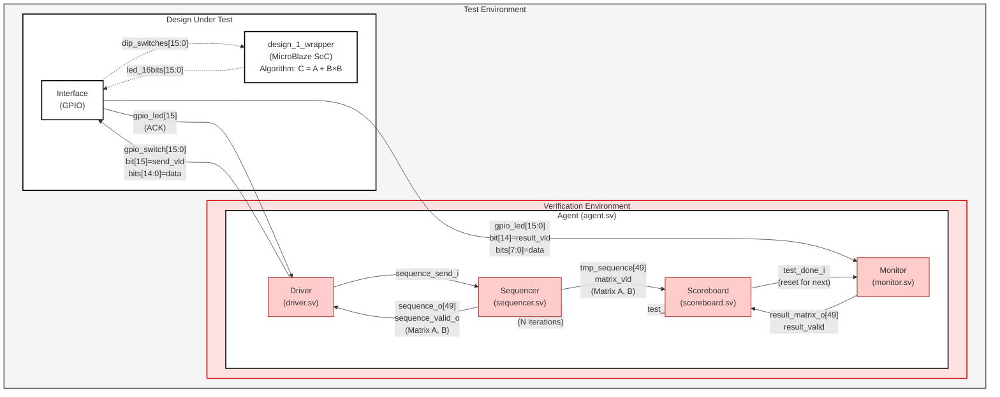
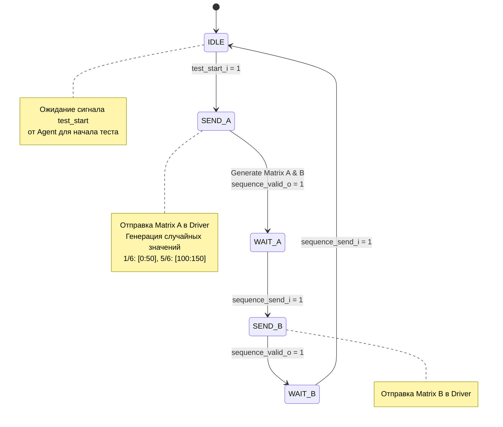
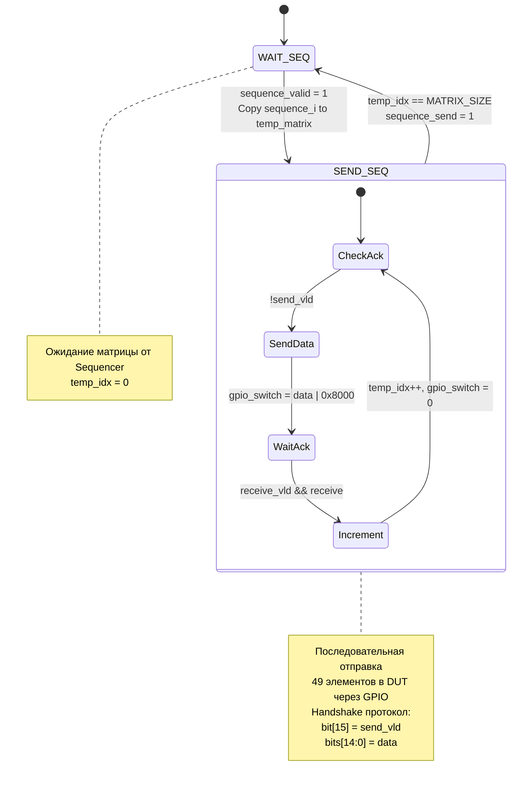
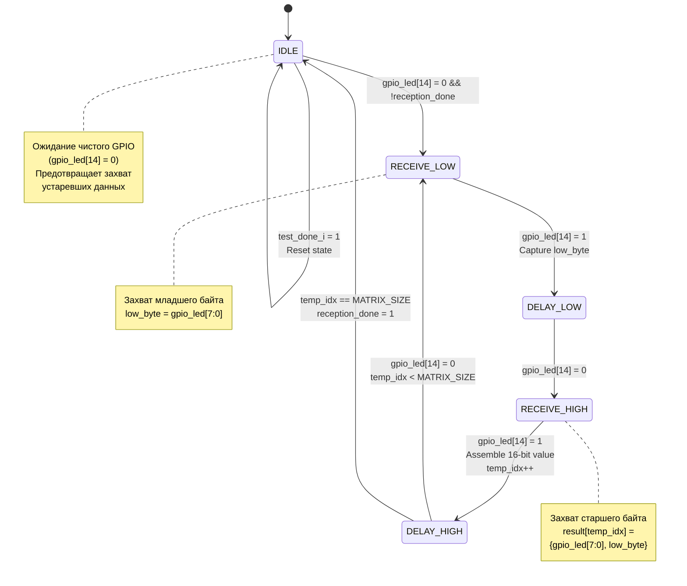
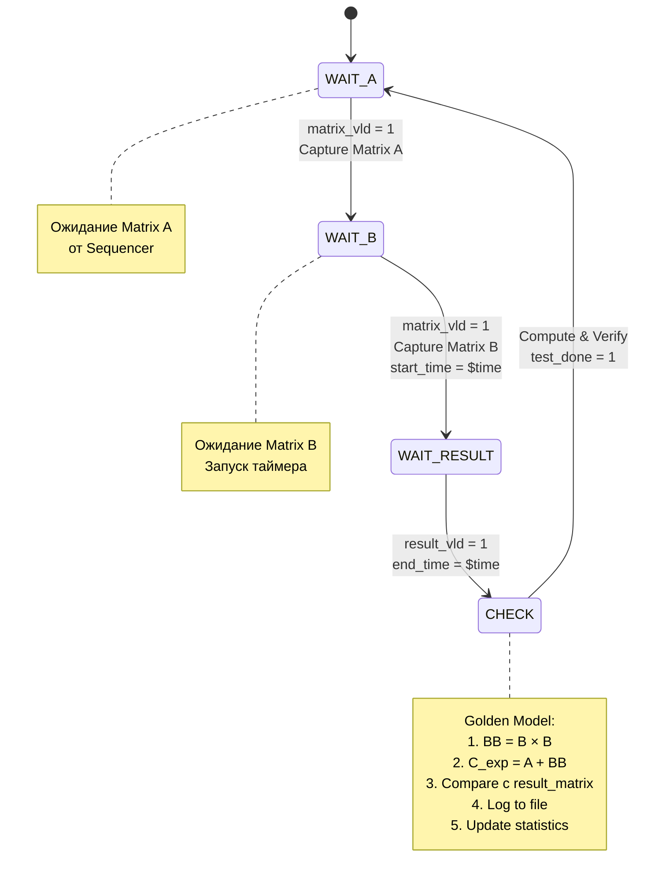
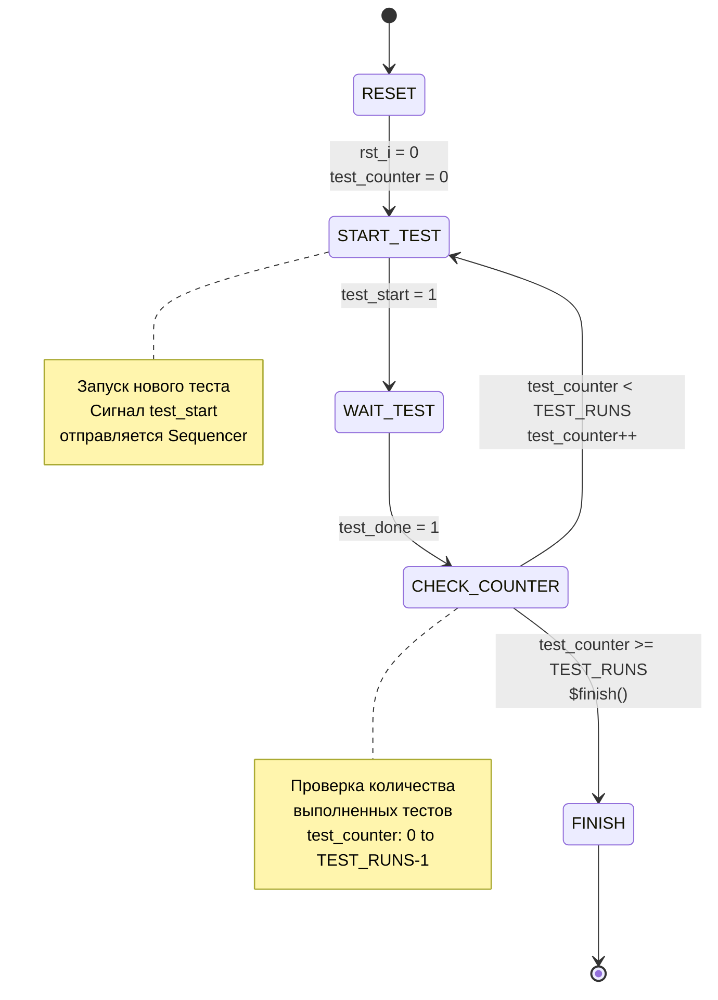
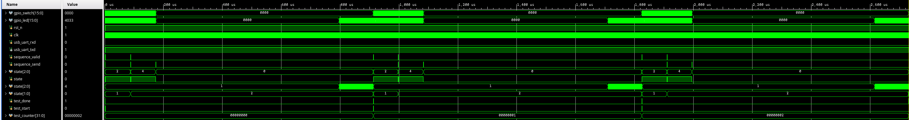

<div align="center">


<h3 style="margin-top: 50px;">Федеральное государственное автономное образовательное учреждение высшего образования</h3>

<h3 style="margin-top: 50px;">Университет ИТМО</h3>

<h3 style="margin-top: 50px;">Системы на кристалле</h3>
<h3>Лабораторная работа №2</h3>
<h3>"Проектирование верификационного окружения для СнК"</h3>

<h3 style="margin-top: 50px;">Вариант 1</h3>

<div style="margin-left: 500px; margin-top: 100px; text-align: right">
<h3>Выполнили:</h3>
<h4>Бутвин Михаил Павлович, Группа P3430</h4>
<h4>Николаев Павел Дмитриевич, Группа P3430</h4>
<h4>Хабнер Георгий Евгеньевич, Группа P3431</h4>
</div>

<h3 style="margin-top: 50px;">СПб – 2025</h3>
</div>
<div style="page-break-after: always;"></div>

## Вариант

**Вариант 1**: Разработать верификационное окружение для системы на кристалле из лабораторной работы №1

**Алгоритм**: `C = A + B*B` для матриц 7x7

**Ограничения рандомизации входных сигналов**:

- С вероятностью 1/6: значения из диапазона [0:50]
- С вероятностью 5/6: значения из диапазона [100:150]

## Структура разработанного верификационного окружения

**Примечание:** В соответствии с заданием, Monitor должен сохранять в файл входные и выходные сигналы. Однако в данной реализации логирование вынесено в Scoreboard, так как:

- Scoreboard имеет доступ ко всем необходимым данным (входные матрицы A и B от Sequencer, выходные данные от Monitor, ожидаемые результаты от эталонной модели)
- Scoreboard отвечает за верификацию, поэтому логично записывать результаты сравнения в том же компоненте
- Это соответствует методологии UVM, где Scoreboard является центром анализа и отчётности

<div style="page-break-after: always;"></div>

### Архитектура верификационного окружения



**Описание архитектуры:**

Верификационное окружение построено по методологии Universal Verification Methodology (UVM) и состоит из следующих компонентов:

**Иерархия компонентов:**

1. **Test Environment** - верхний уровень тестового окружения
   - **Verification Environment** - верификационное окружение (розовый блок)
     - **Agent** - центральный координатор, содержащий все компоненты верификации
       - **Scoreboard** - верификатор результатов с Golden Model
       - **Sequencer** - генератор тестовых последовательностей
       - **Monitor** - наблюдатель за выходными сигналами DUT
       - **Driver** - драйвер входных сигналов DUT
   - **Design Under Test** - проверяемая система
     - **Interface (GPIO)** - интерфейс взаимодействия
     - **design_1_wrapper** - MicroBlaze SoC с алгоритмом C = A + B×B

**Основные потоки данных:**

1. **Управление жизненным циклом тестов**
   - Agent → `test_start` (N итераций) → Sequencer: запуск каждого из N тестов
   - Scoreboard → `test_done` → Agent: завершение верификации текущего теста

2. **Генерация и передача тестовых данных**
   - Sequencer → `sequence_o[49]` + `sequence_valid_o` → Driver: матрицы A и B (49 элементов каждая)
   - Driver → `sequence_send_i` → Sequencer: подтверждение отправки
   - Sequencer → `tmp_sequence[49]` + `matrix_vld` → Scoreboard: эталонные матрицы для проверки

3. **Передача данных в DUT (GPIO Driver → DUT)**
   - Driver → `gpio_switch[15:0]` (bit[15]=send_vld, bits[14:0]=data) → Interface
   - Interface → `gpio_led[15]` (ACK) → Driver: квитирование приёма
   - Interface → `dip_switches[15:0]` → Design: физический интерфейс

4. **Обработка данных**
   - Design выполняет алгоритм C = A + B×B
   - Design → `led_16bits[15:0]` → Interface: результаты вычислений

5. **Захват результатов (GPIO DUT → Monitor)**
   - Interface → `gpio_led[15:0]` (bit[14]=result_vld, bits[7:0]=data) → Monitor
   - Протокол: 16-бит передаётся как 2 байта (младший, старший)

6. **Проверка результатов**
   - Monitor → `result_matrix_o[49]` + `result_valid` → Scoreboard: захваченные результаты (49 элементов)
   - Scoreboard: эталонная модель вычисляет BB = B × B, затем C_exp = A + BB
   - Scoreboard: поэлементное сравнение ожидаемого и фактического результата
   - Scoreboard → `test_done_i` → Monitor: сброс монитора для следующего теста
   - Scoreboard логирует результаты в файл `scoreboard_log.txt` и собирает статистику

**Ключевые особенности:**

- **Поддержка множественных тестов**: Agent управляет запуском N тестов (TEST_RUNS из tb_defines.svh), подавая разные входные параметры в каждой итерации
- **Рандомизация**: Sequencer генерирует случайные матрицы с заданным распределением (1/6: [0:50], 5/6: [100:150])
- **Обработка протоколов**: Driver и Monitor реализуют GPIO handshake протоколы для надёжной передачи данных
- **Эталонная модель**: Scoreboard независимо вычисляет ожидаемый результат для верификации
- **Централизованное логирование**: Логирование вынесено в Scoreboard, а не Monitor, так как Scoreboard имеет доступ ко всем результатам (входные матрицы A и B, ожидаемые результаты, фактические результаты от DUT), что позволяет создавать полный отчёт о верификации

<div style="page-break-after: always;"></div>

### Диаграммы состояний компонентов (FSM)

#### Sequencer FSM



**Состояния:**

- **IDLE**: Ожидание сигнала `test_start_i` от Agent
- **SEND_A**: Генерация случайных матриц A и B, отправка Matrix A (sequence_o ← matrix_a, sequence_valid_o = 1)
- **WAIT_A**: Ожидание подтверждения `sequence_send_i` от Driver
- **SEND_B**: Отправка Matrix B (sequence_o ← matrix_b, sequence_valid_o = 1)
- **WAIT_B**: Ожидание подтверждения `sequence_send_i`, затем возврат в IDLE для следующего теста

<div style="page-break-after: always;"></div>

#### Driver FSM



**Состояния:**

- **WAIT_SEQ**: Ожидание валидной последовательности от Sequencer (sequence_valid = 1)
- **SEND_SEQ**: Последовательная отправка 49 элементов матрицы в DUT
  - Устанавливает `gpio_switch[15] = 1` (send_vld) с данными в битах [14:0]
  - Ожидает `gpio_led[15] = 1` (ACK от DUT)
  - Сбрасывает `gpio_switch = 0` после ACK
  - Увеличивает счётчик temp_idx
  - После отправки всех элементов устанавливает `sequence_send = 1`

<div style="page-break-after: always;"></div>

#### Monitor FSM



**Состояния:**

- **IDLE**: Ожидание начала передачи (gpio_led[14] = 0, чистый GPIO)
- **RECEIVE_LOW**: Захват младшего байта (low_byte ← gpio_led[7:0]) при gpio_led[14] = 1
- **DELAY_LOW**: Ожидание сброса gpio_led[14] = 0
- **RECEIVE_HIGH**: Захват старшего байта, сборка 16-бит значения: result_matrix_o[temp_idx] ← {gpio_led[7:0], low_byte}
- **DELAY_HIGH**: Ожидание сброса gpio_led[14] = 0, проверка завершения (temp_idx == MATRIX_SIZE)
- При `test_done_i = 1` сброс в IDLE для следующего теста

<div style="page-break-after: always;"></div>

#### Scoreboard FSM



**Состояния:**

- **WAIT_A**: Ожидание Matrix A от Sequencer (matrix_vld = 1), сохранение matrix_a
- **WAIT_B**: Ожидание Matrix B от Sequencer (matrix_vld = 1), сохранение matrix_b, запуск таймера (start_time = $time)
- **WAIT_RESULT**: Ожидание результатов от Monitor (result_vld = 1), остановка таймера (end_time = $time)
- **CHECK**: Верификация результатов
  1. Вычисление BB = B × B (матричное умножение)
  2. Вычисление C_exp = A + BB (матричное сложение)
  3. Поэлементное сравнение expected[i] vs result_matrix[i]
  4. Логирование в файл (матрицы, результаты, время)
  5. Обновление статистики (tests_passed/tests_failed)
  6. Установка `test_done = 1` для Agent

<div style="page-break-after: always;"></div>

#### Agent Test Control Logic



**Логика работы Agent:**

- **RESET**: Инициализация (test_counter = 0, test_start = 1)
- **START_TEST**: Установка `test_start = 1` для запуска Sequencer
- **WAIT_TEST**: Ожидание завершения теста (`test_done = 1` от Scoreboard)
- **CHECK_COUNTER**: Проверка счётчика тестов
  - Если test_counter < TEST_RUNS: инкремент счётчика, запуск следующего теста
  - Если test_counter >= TEST_RUNS: вызов `$finish()`, завершение симуляции

<div style="page-break-after: always;"></div>

### Основные компоненты

Верификационное окружение реализовано по архитектуре Universal Verification Methodology

0. **Configuration (tb_defines.svh)** - файл определений констант
   - `MATRIX_SIZE = 49` - размер матрицы в линейном представлении (7×7)
   - `MATRIX_DIM = 7` - размерность матрицы
   - `TEST_RUNS = 3` - количество запускаемых тестов
   - Единая точка определения размеров для всех модулей тестового окружения

1. **Testbench (dev_tb.v)** - главный модуль тестового окружения
   - Генерация тактовых сигналов (100 МГц)
   - Управление сбросом системы
   - Инстанцирование DUT и агента верификации

2. **Agent (agent.sv)** - координатор верификационного окружения
   - Центральный узел координации всех компонентов
   - Хранение эталонных входных матриц A и B
   - Управление потоком данных между компонентами

3. **Sequencer (sequencer.sv)** - генератор тестовых последовательностей
   - Генерация случайных входных матриц с заданным распределением
   - Конечный автомат для управления последовательностью генерации
   - Реализация рандомизации генерации входных данных

4. **Driver (driver.sv)** - драйвер интерфейса
   - Отправка данных и сигналов к входам DUT через GPIO интерфейс
   - Реализация протокола обмена данными с DUT
   - Управление синхронизацией передачи данных

5. **Monitor (monitor.sv)** - монитор выходных сигналов
   - Наблюдение за выходными сигналами DUT через GPIO LED
   - Захват результатов вычислений из DUT

6. **Scoreboard (scoreboard.sv)** - верификатор результатов
   - Вычисление эталонного результата (включая промежуточный результат B\*B)
   - Сравнение фактических результатов DUT с ожидаемыми
   - Подробное логирование всех матриц и сравнения в файл
   - Измерение времени выполнения алгоритма
   - Формирование итогового вердикта

<div style="page-break-after: always;"></div>

## Содержимое файла scoreboard_log.txt

Scoreboard логирует полный процесс верификации, включая входные данные, ожидаемые результаты, фактические результаты и их детальное сравнение:

```
Test #1
Input Matrix A:
  [120 133 150 127 126 127 118]
  [147 114 130 126 131 0 118]
  [126 100 103 138 131 144 11]
  [140 44 112 143 110 100 110]
  [130 103 122 149 112 146 126]
  [120 139 134 108 134 124 148]
  [8 120 126 126 134 133 142]
Input Matrix B:
  [131 125 149 133 106 102 129]
  [121 107 148 100 121 136 137]
  [123 35 17 127 142 132 141]
  [126 102 107 112 107 105 12]
  [45 150 121 106 44 129 115]
  [127 16 128 105 112 131 122]
  [102 100 106 46 120 9 148]
Expected Result:
  [32837 13560 28953 26213 30558 26783 34937]
  [30904 10558 28246 24787 29080 26052 37701]
  [10567 4745 20976 6242 5823 4372 12360]
  [10099 60807 9908 10617 5358 14838 8124]
  [16971 56989 10916 6336 16204 10312 17096]
  [16252 64012 12552 12318 13647 10346 19413]
  [407 64916 2672 62779 1532 60950 13764]
Actual Result:
  [32837 13560 28953 26213 30558 26783 34937]
  [30904 10558 28246 24787 29080 26052 37701]
  [10567 4745 20976 6242 5823 4372 12360]
  [10099 60807 9908 10617 5358 14838 8124]
  [16971 56989 10916 6336 16204 10312 17096]
  [16252 64012 12552 12318 13647 10346 19413]
  [407 64916 2672 62779 1532 60950 13764]
[          0] expected=32837, result=32837
[          1] expected=13560, result=13560
[          2] expected=28953, result=28953
[          3] expected=26213, result=26213
[          4] expected=30558, result=30558
[          5] expected=26783, result=26783
[          6] expected=34937, result=34937
[          7] expected=30904, result=30904
[          8] expected=10558, result=10558
[          9] expected=28246, result=28246
[         10] expected=24787, result=24787
[         11] expected=29080, result=29080
[         12] expected=26052, result=26052
[         13] expected=37701, result=37701
[         14] expected=10567, result=10567
[         15] expected=4745, result=4745
[         16] expected=20976, result=20976
[         17] expected=6242, result=6242
[         18] expected=5823, result=5823
[         19] expected=4372, result=4372
[         20] expected=12360, result=12360
[         21] expected=10099, result=10099
[         22] expected=60807, result=60807
[         23] expected=9908, result=9908
[         24] expected=10617, result=10617
[         25] expected=5358, result=5358
[         26] expected=14838, result=14838
[         27] expected=8124, result=8124
[         28] expected=16971, result=16971
[         29] expected=56989, result=56989
[         30] expected=10916, result=10916
[         31] expected=6336, result=6336
[         32] expected=16204, result=16204
[         33] expected=10312, result=10312
[         34] expected=17096, result=17096
[         35] expected=16252, result=16252
[         36] expected=64012, result=64012
[         37] expected=12552, result=12552
[         38] expected=12318, result=12318
[         39] expected=13647, result=13647
[         40] expected=10346, result=10346
[         41] expected=19413, result=19413
[         42] expected=407, result=407
[         43] expected=64916, result=64916
[         44] expected=2672, result=2672
[         45] expected=62779, result=62779
[         46] expected=1532, result=1532
[         47] expected=60950, result=60950
[         48] expected=13764, result=13764
Result: PASSED
Execution time: 823900000 ns
Progress: 1/3


Test #2
Input Matrix A:
  [44 110 114 150 132 26 119]
  [112 131 113 132 142 101 28]
  [125 108 12 105 111 124 148]
  [101 17 103 147 3 108 103]
  [117 146 112 6 109 131 139]
  [148 115 119 119 108 15 131]
  [150 46 126 103 137 135 124]
Input Matrix B:
  [112 131 36 125 111 144 11]
  [150 149 122 110 138 143 114]
  [119 104 135 128 111 105 123]
  [129 118 116 11 117 148 136]
  [147 130 130 144 150 107 103]
  [107 29 147 20 121 114 124]
  [142 124 150 114 123 117 134]
Expected Result:
  [20398 7229 11200 54661 19154 21211 2940]
  [54209 38337 43446 22290 50255 50968 30316]
  [41112 27528 32836 11678 36581 37953 22725]
  [34283 18690 27909 13997 31419 29133 13829]
  [52716 39124 40661 20851 48224 49614 29134]
  [18612 4977 15226 4024 16304 12880 3094]
  [51302 36639 41593 21739 46552 47578 29373]
Actual Result:
  [20398 7229 11200 54661 19154 21211 2940]
  [54209 38337 43446 22290 50255 50968 30316]
  [41112 27528 32836 11678 36581 37953 22725]
  [34283 18690 27909 13997 31419 29133 13829]
  [52716 39124 40661 20851 48224 49614 29134]
  [18612 4977 15226 4024 16304 12880 3094]
  [51302 36639 41593 21739 46552 47578 29373]
[          0] expected=20398, result=20398
[          1] expected=7229, result=7229
[          2] expected=11200, result=11200
[          3] expected=54661, result=54661
[          4] expected=19154, result=19154
[          5] expected=21211, result=21211
[          6] expected=2940, result=2940
[          7] expected=54209, result=54209
[          8] expected=38337, result=38337
[          9] expected=43446, result=43446
[         10] expected=22290, result=22290
[         11] expected=50255, result=50255
[         12] expected=50968, result=50968
[         13] expected=30316, result=30316
[         14] expected=41112, result=41112
[         15] expected=27528, result=27528
[         16] expected=32836, result=32836
[         17] expected=11678, result=11678
[         18] expected=36581, result=36581
[         19] expected=37953, result=37953
[         20] expected=22725, result=22725
[         21] expected=34283, result=34283
[         22] expected=18690, result=18690
[         23] expected=27909, result=27909
[         24] expected=13997, result=13997
[         25] expected=31419, result=31419
[         26] expected=29133, result=29133
[         27] expected=13829, result=13829
[         28] expected=52716, result=52716
[         29] expected=39124, result=39124
[         30] expected=40661, result=40661
[         31] expected=20851, result=20851
[         32] expected=48224, result=48224
[         33] expected=49614, result=49614
[         34] expected=29134, result=29134
[         35] expected=18612, result=18612
[         36] expected=4977, result=4977
[         37] expected=15226, result=15226
[         38] expected=4024, result=4024
[         39] expected=16304, result=16304
[         40] expected=12880, result=12880
[         41] expected=3094, result=3094
[         42] expected=51302, result=51302
[         43] expected=36639, result=36639
[         44] expected=41593, result=41593
[         45] expected=21739, result=21739
[         46] expected=46552, result=46552
[         47] expected=47578, result=47578
[         48] expected=29373, result=29373
Result: PASSED
Execution time: 827890000 ns
Progress: 2/3


Test #3
Input Matrix A:
  [126 113 133 138 118 130 113]
  [134 110 136 113 127 102 6]
  [108 132 129 5 150 143 111]
  [118 136 145 137 133 117 147]
  [19 147 143 113 139 109 101]
  [144 125 103 135 147 46 41]
  [114 41 132 110 107 123 114]
Input Matrix B:
  [26 130 110 8 140 149 100]
  [113 139 140 113 143 137 143]
  [110 120 126 123 118 112 146]
  [119 6 130 30 109 150 143]
  [136 1 103 129 119 131 148]
  [105 28 138 146 114 16 46]
  [127 114 132 24 137 132 21]
Expected Result:
  [10393 50523 18739 5484 18010 3722 2645]
  [34084 6344 51331 13679 51351 42877 32715]
  [25839 1332 42241 3175 42261 36521 24402]
  [4959 52831 19622 58050 20387 7749 62210]
  [13548 51759 29326 55882 29372 23081 8539]
  [61618 40909 6427 43639 7205 12609 8609]
  [3297 54608 19377 2877 21073 10343 13073]
Actual Result:
  [10393 50523 18739 5484 18010 3722 2645]
  [34084 6344 51331 13679 51351 42877 32715]
  [25839 1332 42241 3175 42261 36521 24402]
  [4959 52831 19622 58050 20387 7749 62210]
  [13548 51759 29326 55882 29372 23081 8539]
  [61618 40909 6427 43639 7205 12609 8609]
  [3297 54608 19377 2877 21073 10343 13073]
[          0] expected=10393, result=10393
[          1] expected=50523, result=50523
[          2] expected=18739, result=18739
[          3] expected=5484, result=5484
[          4] expected=18010, result=18010
[          5] expected=3722, result=3722
[          6] expected=2645, result=2645
[          7] expected=34084, result=34084
[          8] expected=6344, result=6344
[          9] expected=51331, result=51331
[         10] expected=13679, result=13679
[         11] expected=51351, result=51351
[         12] expected=42877, result=42877
[         13] expected=32715, result=32715
[         14] expected=25839, result=25839
[         15] expected=1332, result=1332
[         16] expected=42241, result=42241
[         17] expected=3175, result=3175
[         18] expected=42261, result=42261
[         19] expected=36521, result=36521
[         20] expected=24402, result=24402
[         21] expected=4959, result=4959
[         22] expected=52831, result=52831
[         23] expected=19622, result=19622
[         24] expected=58050, result=58050
[         25] expected=20387, result=20387
[         26] expected=7749, result=7749
[         27] expected=62210, result=62210
[         28] expected=13548, result=13548
[         29] expected=51759, result=51759
[         30] expected=29326, result=29326
[         31] expected=55882, result=55882
[         32] expected=29372, result=29372
[         33] expected=23081, result=23081
[         34] expected=8539, result=8539
[         35] expected=61618, result=61618
[         36] expected=40909, result=40909
[         37] expected=6427, result=6427
[         38] expected=43639, result=43639
[         39] expected=7205, result=7205
[         40] expected=12609, result=12609
[         41] expected=8609, result=8609
[         42] expected=3297, result=3297
[         43] expected=54608, result=54608
[         44] expected=19377, result=19377
[         45] expected=2877, result=2877
[         46] expected=21073, result=21073
[         47] expected=10343, result=10343
[         48] expected=13073, result=13073
Result: PASSED
Execution time: 820820000 ns
Progress: 3/3


FINAL SUMMARY:
Total:  3
Passed: 3
Failed: 0
Rate:   100.0%
```

<div style="page-break-after: always;"></div>

### 0. Configuration (tb_defines.svh)

```systemverilog
`ifndef TB_DEFINES_SVH
`define TB_DEFINES_SVH

// Matrix dimensions
`define MATRIX_SIZE 49  // 7x7 matrix flattened
`define MATRIX_DIM 7    // Matrix dimension

// Test configuration
`define TEST_RUNS 3    // Number of test iterations

`endif  // TB_DEFINES_SVH
```

<div style="page-break-after: always;"></div>

### 1. Testbench (dev_tb.v)

```systemverilog
`timescale 1ns / 1ns

module dev_tb ();
    localparam MATRIX_SIZE = 49;

    wire [15:0] gpio_switch;
    wire [15:0] gpio_led;
    reg rst_n;
    reg clk;
    reg usb_uart_rxd;
    wire usb_uart_txd;

    agent agent_impl (
        .clk_i(clk),
        .rst_i(~rst_n),
        .gpio_switch(gpio_switch),
        .gpio_led(gpio_led)
    );

    design_1_wrapper uut (
        .dip_switches_16bits_tri_i(gpio_switch),
        .led_16bits_tri_o(gpio_led),
        .reset(rst_n),
        .sys_clock(clk),
        .usb_uart_rxd(usb_uart_rxd),
        .usb_uart_txd(usb_uart_txd)
    );


    initial begin
        rst_n = 0;
        clk = 0;
        usb_uart_rxd = 0;
        #200 rst_n = 1;
    end

    always #5 clk = ~clk;
endmodule
```

<div style="page-break-after: always;"></div>

### 2. Agent (agent.sv)

```systemverilog
`timescale 1ns / 1ps

`include "tb_defines.svh"

module agent (
    input clk_i,
    input rst_i,
    output [15:0] gpio_switch,
    input [15:0] gpio_led
);

    logic [15:0] tmp_sequence[`MATRIX_SIZE];
    logic [15:0] result_sequence[`MATRIX_SIZE];
    logic sequence_valid, sequence_send, result_valid;
    logic test_done, test_start;

    integer test_counter;

    sequencer sequencer_impl (
        .clk_i(clk_i),
        .rst_i(rst_i),
        .sequence_o(tmp_sequence),
        .sequence_valid_o(sequence_valid),
        .sequence_send_i(sequence_send),
        .test_start_i(test_start)
    );

    driver driver_impl (
        .clk(clk_i),
        .rst(rst_i),

        .sequence_i(tmp_sequence),
        .sequence_valid(sequence_valid),
        .sequence_send(sequence_send),

        .gpio_switch(gpio_switch),
        .gpio_led(gpio_led)
    );

    monitor monitor_impl (
        .clk(clk_i),
        .rst(rst_i),
        .gpio_led(gpio_led),

        .result_matrix_o(result_sequence),
        .result_valid(result_valid),
        .test_done_i(test_done)
    );

    scoreboard scoreboard_impl (
        .clk_i(clk_i),
        .rst_i(rst_i),

        .matrix_input(tmp_sequence),
        .matrix_vld  (sequence_valid),

        .result_matrix(result_sequence),
        .result_vld(result_valid),

        .test_done(test_done)
    );

    always_ff @(posedge clk_i) begin
        if (rst_i) begin
            test_counter <= 0;
            test_start   <= 1;
        end else begin
            if (test_done) begin
                test_counter <= test_counter + 1;
                if (test_counter + 1 >= `TEST_RUNS) begin
                    $display("\n=== All %0d tests completed ===\n", `TEST_RUNS);
                    $finish();
                end else begin
                    test_start <= 1;
                end
            end else begin
                test_start <= 0;
            end
        end
    end
endmodule
```

<div style="page-break-after: always;"></div>

### 3. Sequencer (sequencer.sv)

```systemverilog
`timescale 1ns / 1ps

`include "tb_defines.svh"

module sequencer (
    input clk_i,
    input rst_i,
    output logic [15:0] sequence_o[`MATRIX_SIZE],
    output logic sequence_valid_o,
    input sequence_send_i,
    input test_start_i
);
    localparam IDLE = 0;
    localparam SEND_A = 1;
    localparam WAIT_A = 2;
    localparam SEND_B = 3;
    localparam WAIT_B = 4;

    logic [15:0] matrix_a[`MATRIX_SIZE];
    logic [15:0] matrix_b[`MATRIX_SIZE];

    logic [2:0] state;

    function automatic logic [15:0] gen_random_value();
        int rand_choice;
        int rand_val;

        rand_choice = $urandom_range(5, 0);

        if (rand_choice == 0) begin
            rand_val = $urandom_range(50, 0);
        end else begin
            rand_val = $urandom_range(150, 100);
        end

        return rand_val[15:0];
    endfunction

    always_ff @(posedge clk_i) begin
        if (rst_i) begin
            state <= IDLE;
            for (int i = 0; i < `MATRIX_SIZE; i++) begin
                sequence_o[i] <= '0;
                matrix_a[i]   <= '0;
                matrix_b[i]   <= '0;
            end
            sequence_valid_o <= '0;
        end else begin
            case (state)
                IDLE: begin
                    if (test_start_i) begin
                        for (int i = 0; i < `MATRIX_SIZE; i++) begin
                            matrix_a[i] <= gen_random_value();
                            matrix_b[i] <= gen_random_value();
                        end
                        state <= SEND_A;
                    end
                    sequence_valid_o <= 0;
                end
                SEND_A: begin
                    sequence_o <= matrix_a;
                    sequence_valid_o <= 1;
                    state <= WAIT_A;
                end
                WAIT_A: begin
                    sequence_valid_o <= 0;
                    if (sequence_send_i) begin
                        state <= SEND_B;
                    end
                end
                SEND_B: begin
                    sequence_o <= matrix_b;
                    sequence_valid_o <= 1;
                    state <= WAIT_B;
                end
                WAIT_B: begin
                    sequence_valid_o <= 0;
                    if (sequence_send_i) begin
                        state <= IDLE;
                    end
                end
            endcase
        end
    end
endmodule
```

<div style="page-break-after: always;"></div>

### 4. Driver (driver.sv)

```systemverilog
`timescale 1ns / 1ps

`include "tb_defines.svh"

module driver (
    input clk,
    input rst,

    input [15:0] sequence_i[`MATRIX_SIZE],
    input sequence_valid,
    output logic sequence_send,

    output logic [15:0] gpio_switch,
    input [15:0] gpio_led
);
    localparam WAIT_SEQ = 0;
    localparam SEND_SEQ = 1;

    logic state;
    logic receive;

    logic [15:0] temp_matrix[`MATRIX_SIZE];
    logic [5:0] temp_idx;

    wire send_vld = gpio_switch[15];
    wire receive_vld = gpio_led[15];

    always_ff @(posedge clk) begin
        if (rst) begin
            for (int i = 0; i < `MATRIX_SIZE; i++) begin
                temp_matrix[i] <= '0;
            end
            temp_idx <= 0;
            state <= WAIT_SEQ;
            receive <= 0;
            sequence_send <= 0;
        end else begin
            case (state)
                WAIT_SEQ: begin
                    receive <= 0;
                    temp_idx <= 0;
                    sequence_send <= 0;
                    if (sequence_valid) begin
                        temp_matrix <= sequence_i;
                        state <= SEND_SEQ;
                    end
                end
                SEND_SEQ: begin
                    if (temp_idx == `MATRIX_SIZE) begin
                        state <= WAIT_SEQ;
                        sequence_send <= 1;
                    end else begin
                        if (send_vld) begin
                            if (receive && !receive_vld) begin
                                temp_idx <= temp_idx + 1'b1;
                                gpio_switch <= 0;
                                receive <= 0;
                            end else if (receive_vld) begin
                                receive <= 1;
                            end
                        end else begin
                            gpio_switch <= temp_matrix[temp_idx] | 16'h8000;
                        end
                    end
                end
            endcase
        end
    end
endmodule
```

<div style="page-break-after: always;"></div>

### 5. Monitor (monitor.sv)

```systemverilog
`timescale 1ns / 1ps

`include "tb_defines.svh"

module monitor (
    input clk,
    input rst,
    input [15:0] gpio_led,

    output logic [15:0] result_matrix_o[`MATRIX_SIZE],
    output result_valid,

    input test_done_i
);

    localparam IDLE = 0;
    localparam RECEIVE_LOW = 1;
    localparam DELAY_LOW = 2;
    localparam RECEIVE_HIGH = 3;
    localparam DELAY_HIGH = 4;

    logic [5:0] temp_idx;
    logic [2:0] state;
    logic [7:0] low_byte;
    logic reception_done;

    always_ff @(posedge clk) begin
        if (rst) begin
            temp_idx <= 0;
            state <= IDLE;
            low_byte <= 0;
            reception_done <= 0;
            for (int i = 0; i < `MATRIX_SIZE; i++) begin
                result_matrix_o[i] <= '0;
            end
        end else begin
            if (test_done_i) begin
                temp_idx <= 0;
                state <= IDLE;
                low_byte <= 0;
                reception_done <= 0;
            end else if (!reception_done) begin
                case (state)
                    IDLE: begin
                        // Wait for gpio_led[14] to be 0 (no transmission in progress)
                        if (!gpio_led[14]) begin
                            state <= RECEIVE_LOW;
                        end
                    end
                    RECEIVE_LOW: begin
                        if (gpio_led[14]) begin
                            low_byte <= gpio_led[7:0];
                            state <= DELAY_LOW;
                        end
                    end

                    DELAY_LOW: begin
                        if (!gpio_led[14]) begin
                            state <= RECEIVE_HIGH;
                        end
                    end

                    RECEIVE_HIGH: begin
                        if (gpio_led[14]) begin
                            if (temp_idx < `MATRIX_SIZE) begin
                                result_matrix_o[temp_idx] <= {gpio_led[7:0], low_byte};
                                temp_idx <= temp_idx + 1'b1;
                                if (temp_idx + 1 == `MATRIX_SIZE) begin
                                    reception_done <= 1;
                                end
                            end
                            state <= DELAY_HIGH;
                        end
                    end

                    DELAY_HIGH: begin
                        if (!gpio_led[14]) begin
                            state <= RECEIVE_LOW;
                        end
                    end
                endcase
            end
        end
    end

    assign result_valid = (temp_idx == `MATRIX_SIZE) ? 1 : 0;

endmodule
```

<div style="page-break-after: always;"></div>

### 6. Scoreboard (scoreboard.sv)

```systemverilog
`timescale 1ns / 1ps

`include "tb_defines.svh"

module scoreboard (
    input clk_i,
    input rst_i,

    input [15:0] matrix_input[`MATRIX_SIZE],
    input matrix_vld,

    input [15:0] result_matrix[`MATRIX_SIZE],
    input result_vld,

    output logic test_done
);

    localparam WAIT_A = 0;
    localparam WAIT_B = 1;
    localparam WAIT_RESULT = 2;
    localparam CHECK = 3;

    logic [15:0] matrix_a[`MATRIX_SIZE];
    logic [15:0] matrix_b[`MATRIX_SIZE];

    logic [1:0] state;

    integer log_file;
    integer start_time;
    integer end_time;

    integer test_count;
    integer tests_passed;
    integer tests_failed;

    initial begin
        log_file = $fopen("scoreboard_log.txt", "w");
        if (log_file == 0) begin
            $display("Error: Could not open scoreboard log file");
            $finish;
        end
    end

    function automatic logic [15:0] compute_expected(int idx);
        logic [15:0] bb_matrix[`MATRIX_SIZE];
        logic [15:0] result[`MATRIX_SIZE];
        int row, col;

        for (int i = 0; i < `MATRIX_DIM; i++) begin
            for (int j = 0; j < `MATRIX_DIM; j++) begin
                bb_matrix[i*`MATRIX_DIM+j] = 0;
                for (int k = 0; k < `MATRIX_DIM; k++) begin
                    bb_matrix[i*`MATRIX_DIM+j] = bb_matrix[i*`MATRIX_DIM+j] + (matrix_b[i*`MATRIX_DIM+k] * matrix_b[k*`MATRIX_DIM+j]);
                end
            end
        end

        for (int i = 0; i < `MATRIX_SIZE; i++) begin
            result[i] = matrix_a[i] + bb_matrix[i];
        end

        return result[idx];
    endfunction

    always_ff @(posedge clk_i) begin
        if (rst_i) begin
            state <= WAIT_A;
            test_done <= 0;
            test_count <= 0;
            tests_passed <= 0;
            tests_failed <= 0;
            for (int i = 0; i < `MATRIX_SIZE; i++) begin
                matrix_a[i] <= 0;
            end
            for (int i = 0; i < `MATRIX_SIZE; i++) begin
                matrix_b[i] <= 0;
            end
        end else if (state == WAIT_A) begin
            test_done <= 0;
            if (matrix_vld) begin
                matrix_a <= matrix_input;
                state <= WAIT_B;
            end
        end else if (state == WAIT_B) begin
            if (matrix_vld) begin
                matrix_b <= matrix_input;
                start_time = $time;
                state <= WAIT_RESULT;
            end
        end else if (state == WAIT_RESULT) begin
            if (result_vld) begin
                end_time = $time;
                state <= CHECK;
            end
        end else begin
            logic [15:0] expected;
            logic [15:0] expected_matrix[`MATRIX_SIZE];
            logic [15:0] bb_matrix[`MATRIX_SIZE];
            logic test_passed;
            test_passed = 1;
            test_count  = test_count + 1;

            for (int i = 0; i < `MATRIX_DIM; i++) begin
                for (int j = 0; j < `MATRIX_DIM; j++) begin
                    bb_matrix[i*`MATRIX_DIM+j] = 0;
                    for (int k = 0; k < `MATRIX_DIM; k++) begin
                        bb_matrix[i*`MATRIX_DIM+j] = bb_matrix[i*`MATRIX_DIM+j] + (matrix_b[i*`MATRIX_DIM+k] * matrix_b[k*`MATRIX_DIM+j]);
                    end
                end
            end

            for (int i = 0; i < `MATRIX_SIZE; i++) begin
                expected_matrix[i] = matrix_a[i] + bb_matrix[i];
            end

            $display("\nTest #%0d", test_count);
            $fwrite(log_file, "\nTest #%0d\n", test_count);

            $display("Input Matrix A:");
            $fwrite(log_file, "Input Matrix A:\n");
            for (int i = 0; i < `MATRIX_DIM; i++) begin
                $display("  [%0d %0d %0d %0d %0d %0d %0d]", matrix_a[i*`MATRIX_DIM+0],
                         matrix_a[i*`MATRIX_DIM+1], matrix_a[i*`MATRIX_DIM+2],
                         matrix_a[i*`MATRIX_DIM+3], matrix_a[i*`MATRIX_DIM+4],
                         matrix_a[i*`MATRIX_DIM+5], matrix_a[i*`MATRIX_DIM+6]);
                $fwrite(log_file, "  [%0d %0d %0d %0d %0d %0d %0d]\n", matrix_a[i*`MATRIX_DIM+0],
                        matrix_a[i*`MATRIX_DIM+1], matrix_a[i*`MATRIX_DIM+2],
                        matrix_a[i*`MATRIX_DIM+3], matrix_a[i*`MATRIX_DIM+4],
                        matrix_a[i*`MATRIX_DIM+5], matrix_a[i*`MATRIX_DIM+6]);
            end

            $display("Input Matrix B:");
            $fwrite(log_file, "Input Matrix B:\n");
            for (int i = 0; i < `MATRIX_DIM; i++) begin
                $display("  [%0d %0d %0d %0d %0d %0d %0d]", matrix_b[i*`MATRIX_DIM+0],
                         matrix_b[i*`MATRIX_DIM+1], matrix_b[i*`MATRIX_DIM+2],
                         matrix_b[i*`MATRIX_DIM+3], matrix_b[i*`MATRIX_DIM+4],
                         matrix_b[i*`MATRIX_DIM+5], matrix_b[i*`MATRIX_DIM+6]);
                $fwrite(log_file, "  [%0d %0d %0d %0d %0d %0d %0d]\n", matrix_b[i*`MATRIX_DIM+0],
                        matrix_b[i*`MATRIX_DIM+1], matrix_b[i*`MATRIX_DIM+2],
                        matrix_b[i*`MATRIX_DIM+3], matrix_b[i*`MATRIX_DIM+4],
                        matrix_b[i*`MATRIX_DIM+5], matrix_b[i*`MATRIX_DIM+6]);
            end

            $display("Expected Result:");
            $fwrite(log_file, "Expected Result:\n");
            for (int i = 0; i < `MATRIX_DIM; i++) begin
                $display("  [%0d %0d %0d %0d %0d %0d %0d]", expected_matrix[i*`MATRIX_DIM+0],
                         expected_matrix[i*`MATRIX_DIM+1], expected_matrix[i*`MATRIX_DIM+2],
                         expected_matrix[i*`MATRIX_DIM+3], expected_matrix[i*`MATRIX_DIM+4],
                         expected_matrix[i*`MATRIX_DIM+5], expected_matrix[i*`MATRIX_DIM+6]);
                $fwrite(log_file, "  [%0d %0d %0d %0d %0d %0d %0d]\n",
                        expected_matrix[i*`MATRIX_DIM+0], expected_matrix[i*`MATRIX_DIM+1],
                        expected_matrix[i*`MATRIX_DIM+2], expected_matrix[i*`MATRIX_DIM+3],
                        expected_matrix[i*`MATRIX_DIM+4], expected_matrix[i*`MATRIX_DIM+5],
                        expected_matrix[i*`MATRIX_DIM+6]);
            end

            $display("Actual Result:");
            $fwrite(log_file, "Actual Result:\n");
            for (int i = 0; i < `MATRIX_DIM; i++) begin
                $display("  [%0d %0d %0d %0d %0d %0d %0d]", result_matrix[i*`MATRIX_DIM+0],
                         result_matrix[i*`MATRIX_DIM+1], result_matrix[i*`MATRIX_DIM+2],
                         result_matrix[i*`MATRIX_DIM+3], result_matrix[i*`MATRIX_DIM+4],
                         result_matrix[i*`MATRIX_DIM+5], result_matrix[i*`MATRIX_DIM+6]);
                $fwrite(log_file, "  [%0d %0d %0d %0d %0d %0d %0d]\n",
                        result_matrix[i*`MATRIX_DIM+0], result_matrix[i*`MATRIX_DIM+1],
                        result_matrix[i*`MATRIX_DIM+2], result_matrix[i*`MATRIX_DIM+3],
                        result_matrix[i*`MATRIX_DIM+4], result_matrix[i*`MATRIX_DIM+5],
                        result_matrix[i*`MATRIX_DIM+6]);
            end

            for (int i = 0; i < `MATRIX_SIZE; i++) begin
                expected = expected_matrix[i];
                $fwrite(log_file, "[%d] expected=%0d, result=%0d", i, expected, result_matrix[i]);

                if (expected != result_matrix[i]) begin
                    $display("MISMATCH at [%d]: expected=%0d, got=%0d", i, expected,
                             result_matrix[i]);
                    $fwrite(log_file, " [MISMATCH]\n");
                    test_passed = 0;
                end else begin
                    $fwrite(log_file, "\n");
                end
            end

            if (test_passed) begin
                $display("Result: PASSED");
                $fwrite(log_file, "Result: PASSED\n");
                tests_passed = tests_passed + 1;
            end else begin
                $display("Result: FAILED");
                $fwrite(log_file, "Result: FAILED\n");
                tests_failed = tests_failed + 1;
            end

            $display("Execution time: %0t ns", end_time - start_time);
            $display("Progress: %0d/%0d\n", test_count, `TEST_RUNS);

            $fwrite(log_file, "Execution time: %0t ns\n", end_time - start_time);
            $fwrite(log_file, "Progress: %0d/%0d\n\n", test_count, `TEST_RUNS);

            test_done <= 1;
            state <= WAIT_A;
        end
    end

    final begin
        $display("\nFINAL SUMMARY:");
        $display("Total:  %0d", test_count);
        $display("Passed: %0d", tests_passed);
        $display("Failed: %0d", tests_failed);
        $display("Rate:   %0.1f%%\n", (tests_passed * 100.0) / test_count);

        $fwrite(log_file, "\nFINAL SUMMARY:\n");
        $fwrite(log_file, "Total:  %0d\n", test_count);
        $fwrite(log_file, "Passed: %0d\n", tests_passed);
        $fwrite(log_file, "Failed: %0d\n", tests_failed);
        $fwrite(log_file, "Rate:   %0.1f%%\n", (tests_passed * 100.0) / test_count);

        $fclose(log_file);
    end

endmodule
```

<div style="page-break-after: always;"></div>

## Временная диаграмма работы системы

<div align="center">

<p><i>Рис. 1. Временная диаграмма работы верификационного окружения</i></p>
</div>

На временной диаграмме видны основные этапы работы верификационного окружения для одного цикла теста:

1. **Инициализация** (~0-200 нс): Активация сигнала сброса, Agent устанавливает test_counter = 0

**Цикл теста #1:**

2. **Генерация тестовых данных** (~200 нс):
   - Agent устанавливает test_start = 1
   - Sequencer генерирует случайные матрицы A и B

3. **Передача данных** (~200 нс - ~793 мс):
   - Sequencer отправляет матрицы в Driver и Scoreboard
   - Driver последовательно передает 49 элементов матрицы A в DUT через GPIO
   - Driver последовательно передает 49 элементов матрицы B в DUT через GPIO

4. **Выполнение алгоритма** (~793 мс - ~908 мс):
   - DUT вычисляет результат C = A + B×B
   - Scoreboard запускает таймер (start_time)

5. **Прием результатов** (~908 мс):
   - Monitor получает 49 элементов результата от DUT через GPIO
   - Monitor устанавливает result_valid = 1

6. **Верификация** (~908 мс):
   - Scoreboard вычисляет эталонный результат (BB = B×B, C_exp = A+BB)
   - Scoreboard сравнивает фактический результат с эталонным
   - Scoreboard логирует результаты в файл scoreboard_log.txt
   - Scoreboard устанавливает test_done = 1
   - Agent увеличивает test_counter (0 → 1)

**Цикл теста #2:**

7. **Повторение цикла** (~908 мс - ~1736 мс): Повторение шагов 2-6 с новыми случайными матрицами

**Цикл теста #3:**

8. **Повторение цикла** (~1736 мс - ~2556 мс): Повторение шагов 2-6 с новыми случайными матрицами

9. **Завершение** (~2556 мс):
   - Agent проверяет test_counter >= TEST_RUNS (3)
   - Scoreboard выводит итоговую статистику (Total: 3, Passed: 3, Failed: 0, Rate: 100%)
   - Agent вызывает $finish()

<div style="page-break-after: always;"></div>

## Выводы

В ходе выполнения лабораторной работы было разработано полнофункциональное верификационное окружение для микропроцессорной системы на кристалле с использованием подхода Universal Verification Methodology (UVM). Окружение включает все необходимые компоненты: Sequencer, Driver, Monitor, Scoreboard и Agent, организованные в соответствии с принципами UVM.

Реализована полная автоматизация процесса верификации с поддержкой множественных тестов (TEST_RUNS = 3) и рандомизацией входных данных в соответствии с заданными диапазонами (1/6: [0:50], 5/6: [100:150]). Все компоненты взаимодействуют через чётко определённые интерфейсы и протоколы обмена данными.

Особенностью реализации является централизованное логирование в компоненте Scoreboard, что позволяет формировать полный отчёт о верификации, включающий входные данные, ожидаемые и фактические результаты, время выполнения алгоритма и статистику прохождения тестов.

Результаты верификации подтверждают корректность работы микропроцессорной системы: все 3 теста прошли успешно (100% success rate), время выполнения алгоритма C = A + B×B составляет ~115-120 мс для матриц размером 7×7.
