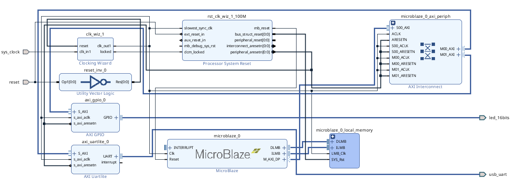
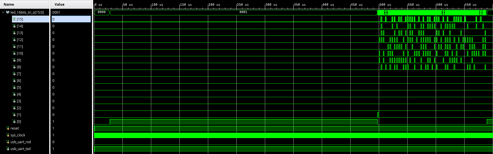

<div align="center">


<h3 style="margin-top: 50px;">Федеральное государственное автономное образовательное учреждение высшего образования</h3>

<h3 style="margin-top: 50px;">Университет ИТМО</h3>

<h3 style="margin-top: 50px;">Системы на кристалле</h3>
<h3>Лабораторная работа №1</h3>
<h3>"Крупно-блочное проектирование микропроцессорной СнК"</h3>

<h3 style="margin-top: 50px;">Вариант 1</h3>

<div style="margin-left: 500px; margin-top: 200px; text-align: right">
<h3>Выполнили:</h3>
<h4>Бутвин Михаил Павлович, Группа P3430</h4>
<h4>Николаев Павел Дмитриевич, Группа P3430</h4>
<h4>Хабнер Георгий Евгеньевич, Группа P3431</h4>
</div>

<h3 style="margin-top: 250px;">СПб – 2025</h3>
</div>
<div style="page-break-after: always;"></div>

## Вариант

**Вариант 1**: Разработать систему на кристалле для выполнения матричных операций:

- Разработать алгоритм расчета операции `C = A + B*B` для матриц 7x7
- Визуализация результатов на светодиодах

## Структура разработанной системы

Проект представляет собой микропроцессорную систему на кристалле для ПЛИС Artix-7 на базе процессора MicroBlaze

### Структурная схема системы

<div align="center">

<p><i>Рис. 1. Структурная схема системы</i></p>
</div>

### Основные компоненты

Система построена на основе IP-ядер Xilinx, соединенных через высокоскоростные интерфейсы AXI4 и LMB:

1. **Процессор MicroBlaze** - 32-битный встраиваемый RISC-процессор
   - Тактовая частота: 100 МГц

2. **Система памяти**
   - Локальная шина памяти LMB (DLMB для данных, ILMB для инструкций)
   - 32 КБ блочной памяти BRAM (0x00000000 - 0x00007FFF)

3. **Периферийные устройства**
   - AXI GPIO (0x40000000) - управление 16-битной шиной светодиодов
   - AXI UARTLite (0x40600000) - последовательный интерфейс для отладки

4. **Системная инфраструктура**
   - Clock Wizard - формирование тактового сигнала 100 МГц
   - AXI Interconnect - взаимодействие процессора с периферией
   - Processor System Reset - управление сбросом системы

## Описание работы системы

Система работает в циклическом режиме, выполняя следующие операции:

1. **Инициализация**: Настройка платформы и периферии
2. **Индикация начала**: Установка LED = 0x0001 (сигнал начала вычислений)
3. **Вычисления**:
   - Матричное умножение: C = B × B
   - Матричное сложение: C = A + C
4. **Индикация завершения**: Установка LED = 0x0002 (сигнал завершения вычислений)
5. **Вывод результатов**: Последовательное отображение элементов матрицы C на светодиодах

Взаимодействие компонентов происходит через шины AXI4 и LMB. Процессор обращается к локальной памяти через высокоскоростные шины LMB, а к периферии (GPIO и UART) - через AXI Interconnect.

## Листинг алгоритма работы

### Функция матричного умножения

```c
void mat_mul(uint8_t A[MAT_SIZE][MAT_SIZE], uint8_t B[MAT_SIZE][MAT_SIZE], uint8_t C[MAT_SIZE][MAT_SIZE]) {
    for (size_t i = 0; i < MAT_SIZE; i++) {
        for (size_t j = 0; j < MAT_SIZE; j++) {
            C[i][j] = 0;
            for (size_t k = 0; k < MAT_SIZE; k++) {
                C[i][j] += A[i][k] * B[k][j];
            }
        }
    }
}
```

### Функция матричного сложения

```c
void mat_add(uint8_t A[MAT_SIZE][MAT_SIZE], uint8_t B[MAT_SIZE][MAT_SIZE], uint8_t C[MAT_SIZE][MAT_SIZE]) {
    for (size_t i = 0; i < MAT_SIZE; i++) {
        for (size_t j = 0; j < MAT_SIZE; j++) {
            C[i][j] = A[i][j] + B[i][j];
        }
    }
}
```

### Основная программа

```c
#define MAT_SIZE 7
#define MAT_LED_START 8
#define OUT_PORT 0x40000000
#define DELAY 10000000

int main() {
    init_platform();

    uint8_t A[MAT_SIZE][MAT_SIZE] = {
        { 0, 4, 8, 8, 9, 10, 5 },
        { 8, 1, 2, 9, 9, 8, 7 },
        { 1, 8, 4, 10, 5, 4, 4 },
        { 10, 4, 8, 5, 3, 2, 7 },
        { 0, 4, 7, 4, 0, 1, 9 },
        { 0, 3, 9, 10, 3, 1, 9 },
        { 1, 7, 1, 9, 4, 0, 7 },
    };

    uint8_t B[MAT_SIZE][MAT_SIZE] = {
        { 69, 4, 8, 8, 9, 10, 5 },
        { 8, 69, 2, 9, 9, 8, 7 },
        { 1, 8, 4, 10, 5, 4, 4 },
        { 10, 4, 8, 5, 3, 2, 7 },
        { 0, 4, 7, 4, 0, 1, 9 },
        { 0, 3, 9, 10, 3, 1, 9 },
        { 1, 7, 1, 9, 4, 0, 69 },
    };

    uint8_t C[MAT_SIZE][MAT_SIZE]; // Результат: A + B*B

    while (1) {
        // Индикация начала вычислений
        uint16_t leds = 0x0001;
        Xil_Out16(OUT_PORT, leds);

        // Выполнение матричных операций
        mat_mul(B, B, C);  // C = B × B
        mat_add(A, C, C);  // C = A + C

        // Индикация завершения вычислений
        leds = 0x0002;
        Xil_Out16(OUT_PORT, leds);

        for (size_t delay = 0; delay < DELAY; delay++);

        // Вывод результатов на светодиоды
        for (size_t i = 0; i < MAT_SIZE; i++) {
            for (size_t j = 0; j < MAT_SIZE; j++) {
                leds = C[i][j] << MAT_LED_START;
                Xil_Out16(OUT_PORT, leds);
                for (size_t delay = 0; delay < DELAY; delay++);

                Xil_Out16(OUT_PORT, 0x0000);
                for (size_t delay = 0; delay < DELAY; delay++);
            }
        }
    }

    cleanup_platform();
    return 0;
}
```

## Работа системы в симуляторе

<div align="center">

<p><i>Рис. 2. Временная диаграмма работы системы</i></p>
</div>

На диаграмме видны ключевые моменты работы алгоритма:

1. **Старт работы алгоритма** (~25 µs): Сигнал `led_16bits_tri_o` принимает значение `0x0001`, что указывает на начало выполнения матричных вычислений

2. **Завершение вычислений** (~500 µs): Сигнал изменяется на `0x0002`, что означает успешное завершение операций умножения и сложения матриц

3. **Вывод результатов** (после 500 µs): Наблюдается последовательная активность на выходе светодиодов LD8-LD15

Общее время выполнения алгоритма (от начала вычислений до их завершения) составляет приблизительно **475 µs** (500 µs - 25 µs).

## [Занимаемые ресурсы ПЛИС](./project_1/project_1.runs/impl_1/design_1_wrapper_utilization_placed.rpt)

Результаты синтеза и имплементации показывают эффективное использование ресурсов целевой ПЛИС:

| Тип ресурса            | Использовано | Доступно | Утилизация |
| ---------------------- | ------------ | -------- | ---------- |
| **Slice LUTs**         | 1158         | 63400    | 1.83%      |
| **Slice Registers**    | 950          | 126800   | 0.75%      |
| **Block RAM (RAMB36)** | 8            | 135      | 5.93%      |
| **DSP блоки**          | 0            | 240      | 0.00%      |
| **Bonded IOB**         | 20           | 210      | 9.52%      |
| **BUFGCTRL**           | 2            | 32       | 6.25%      |
| **MMCME2_ADV**         | 1            | 6        | 16.67%     |

## Время выполнения алгоритма

При тактовой частоте **100 МГц** время выполнения алгоритма составляет ~475 µs (см. Рис. 2) 
